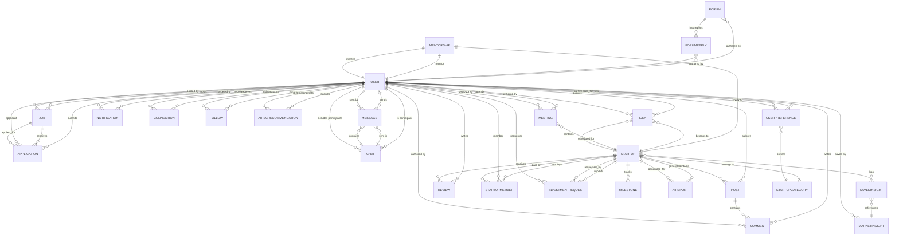

```mermaid
erDiagram
    USER ||--o{ POST : authors
    USER ||--o{ IDEA : authors
    USER ||--o{ COMMENT : writes
    USER ||--o{ REVIEW : writes
    USER ||--o{ MESSAGE : sends
    USER ||--o{ JOB : posts
    USER ||--o{ APPLICATION : submits
    USER ||--o{ NOTIFICATION : receives
    USER ||--o{ CONNECTION : initiates
    USER ||--o{ CONNECTION : receives
    USER ||--o{ FOLLOW : initiates
    USER ||--o{ FOLLOW : receives
    USER ||--o{ AIRECRECOMMENDATION : receives
    USER ||--o{ USERPREFERENCE : has
    USER ||--o{ CHAT : "is participant"
    USER ||--o{ MEETING : attends
    
    STARTUP ||--o{ POST : contains
    STARTUP ||--o{ IDEA : contains
    STARTUP ||--o{ STARTUPMEMBER : employs
    STARTUP ||--o{ REVIEW : receives
    STARTUP ||--o{ INVESTMENTREQUEST : submits
    STARTUP ||--o{ MILESTONE : tracks
    STARTUP ||--o{ AIREPORT : generates
    STARTUP ||--o{ SAVEDINSIGHT : has
    STARTUP }o--|| STARTUPCATEGORY : "belongs to"
    
    JOB ||--o{ APPLICATION : receives
    JOB }o--|| USER : "posted by"
    
    CHAT ||--o{ MESSAGE : contains
    CHAT }o--|| USER : "includes participants"
    
    FORUM ||--o{ FORUMREPLY : "has replies"
    FORUM }o--|| USER : "authored by"
    FORUMREPLY }o--|| USER : "authored by"
    
    POST ||--o{ COMMENT : contains
    COMMENT }o--|| USER : "authored by"
    
    MENTORSHIP ||--|| USER : mentor
    MENTORSHIP ||--|| USER : mentee
    MENTORSHIP ||--|| STARTUP : involved
    
    IDEA }o--|| USER : "authored by"
    IDEA }o--|| STARTUP : "belongs to"
    
    MARKETINSIGHT }o--|| USER : "saved by"
    SAVEDINSIGHT }o--|| MARKETINSIGHT : references
    
    APPLICATION }o--|| USER : applicant
    APPLICATION }o--|| JOB : applied_for
    
    INVESTMENTREQUEST }o--|| STARTUP : requested_by
    INVESTMENTREQUEST }o--|| USER : requester
    
    STARTUPMEMBER }o--|| USER : member
    STARTUPMEMBER }o--|| STARTUP : part_of
    
    USERPREFERENCE }o--|| USER : preferences_for
    USERPREFERENCE }o--|| STARTUPCATEGORY : "prefers"
    
    NOTIFICATION }o--|| USER : "targeted to"
    
    AIRECRECOMMENDATION }o--|| USER : "recommended to"
    AIREPORT }o--|| STARTUP : generated_for
    
    MESSAGE }o--|| CHAT : "sent in"
    MESSAGE }o--|| USER : "sent by"
    
    MEETING }o--|| USER : "attended by"
    MEETING }o--|| STARTUP : "scheduled for"
```
