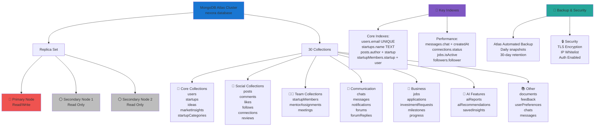

```mermaid
graph TD
    Atlas["MongoDB Atlas Cluster<br/>nexora database"]
    
    Atlas --> Replica["Replica Set"]
    Replica --> Primary["🔴 Primary Node<br/>Read/Write"]
    Replica --> Secondary1["⚪ Secondary Node 1<br/>Read Only"]
    Replica --> Secondary2["⚪ Secondary Node 2<br/>Read Only"]
    
    Atlas --> Collections["30 Collections"]
    
    Collections --> CoreCollections["📌 Core Collections<br/>users<br/>startups<br/>ideas<br/>marketInsights<br/>startupCategories"]
    
    Collections --> SocialCollections["👥 Social Collections<br/>posts<br/>comments<br/>likes<br/>follows<br/>connections<br/>reviews"]
    
    Collections --> TeamCollections["👨‍💼 Team Collections<br/>startupMembers<br/>mentorAssignments<br/>meetings"]
    
    Collections --> CommCollections["💬 Communication<br/>chats<br/>messages<br/>notifications<br/>forums<br/>forumReplies"]
    
    Collections --> BusinessCollections["💼 Business<br/>jobs<br/>applications<br/>investmentRequests<br/>milestones<br/>progress"]
    
    Collections --> AICollections["🤖 AI Features<br/>aiReports<br/>aiRecommendations<br/>savedInsights"]
    
    Collections --> OtherCollections["📚 Other<br/>documents<br/>feedback<br/>userPreferences<br/>chats<br/>messages"]
    
    Indexes["🔑 Key Indexes"]
    Indexes --> CoreIndexes["Core Indexes:<br/>users.email UNIQUE<br/>startups.name TEXT<br/>posts.author + startup<br/>startupMembers.startup + user"]
    Indexes --> PerformanceIndexes["Performance:<br/>messages.chat + createdAt<br/>connections.status<br/>jobs.isActive<br/>followers.follower"]
    
    BackupStrategy["💾 Backup & Security"]
    BackupStrategy --> AutoBackup["Atlas Automated Backup<br/>Daily snapshots<br/>30-day retention"]
    BackupStrategy --> Security["🔒 Security<br/>TLS Encryption<br/>IP Whitelist<br/>Auth Enabled"]
    
    style Atlas fill:#1976D2
    style Primary fill:#EF5350
    style Secondary1 fill:#BDBDBD
    style Secondary2 fill:#BDBDBD
    style Indexes fill:#7E57C2
    style BackupStrategy fill:#26A69A
```
